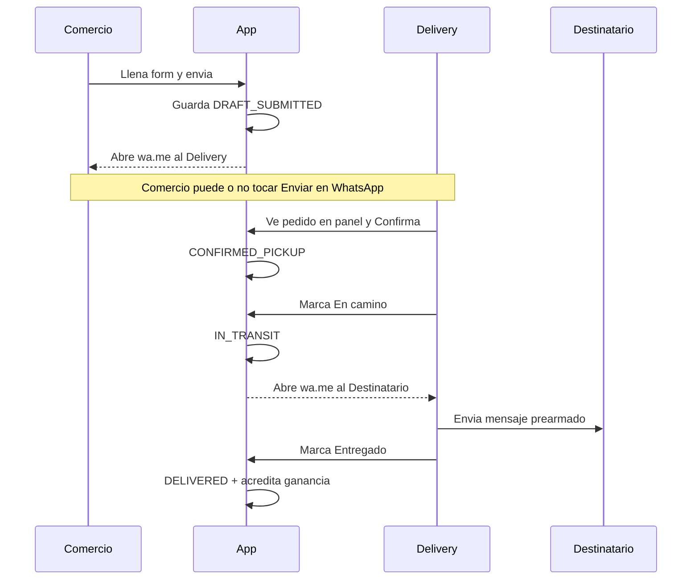

# Flujos del producto

Historia del pedido en lenguaje simple, luego secuencia técnica de WhatsApp.

## Historia completa (happy path)

### 1) El delivery se prepara

1. Inicia sesión en su panel.
2. Crea un comercio (nombre, dirección, teléfono, ubicación en zona).
3. El sistema genera un **link del comercio**.
4. Copia el link y se lo envía al encargado del local.

### 2) El comercio pide el servicio

1. Abre el link (no crea cuenta).
2. Ve el nombre del comercio y del delivery asociado.
3. Completa: qué es, tamaño, quién recibe, teléfono del que recibe.
4. Origen: suele venir precargado con la dirección del comercio (puede ajustar).
5. Destino: **opción A** buscar en el mapa / Places, **opción B** pegar link de ubicación de WhatsApp o Google Maps.
6. El sistema muestra **distancia, tiempo estimado y tarifa**.
7. (F6) Puede adjuntar una foto.
8. Toca **Enviar solicitud**.

### 3) Qué pasa al enviar

1. El sistema **guarda** el pedido como **Solicitado** (`DRAFT_SUBMITTED`).
2. Ofrece un botón / redirección que abre WhatsApp al **teléfono del delivery** con un mensaje listo (resumen + link o referencia al pedido).
3. Si cierran WhatsApp sin enviar: **no importa** — el pedido ya está en el panel del delivery.

### 4) El delivery confirma

1. En el panel ve el pedido pendiente (aunque no le haya llegado el WhatsApp).
2. Revisa datos, mapa, tarifa.
3. Toca **Confirmar** → estado **Va a buscar** (`CONFIRMED_PICKUP`).
4. En esta fase **no** se abre WhatsApp al comercio/remitente (decisión MVP).

### 5) Retiro y en camino

1. Delivery llega al comercio, toma el paquete.
2. En el panel toca **Ya retiré / En camino** → estado `IN_TRANSIT`.
3. Se abre WhatsApp al **destinatario** con mensaje en primera persona del delivery (“Hola, soy … voy en camino…”).
4. Delivery toca enviar en WhatsApp.

### 6) Entrega

1. Al entregar, marca **Entregado** (`DELIVERED`).
2. Se acredita la ganancia de esa carrera.
3. (F7) Aparece en métricas del mes.

### Cancelación

En estados previos a entregado, el delivery (y reglas futuras del comercio) pueden cancelar → `CANCELLED`. No suma ganado.

---

## Diagrama de secuencia (WhatsApp)

---

## Pantallas mínimas

| Pantalla | Quién | Propósito |
|----------|-------|-----------|
| Login | Delivery | Entrar al panel |
| Panel / pedidos en curso | Delivery | Ver pendientes y activos |
| Mis comercios | Delivery | Alta, listado, copiar link |
| Form público `/m/{token}` | Comercio | Crear solicitud + cotizar |
| Detalle de pedido | Delivery | Confirmar / en camino / entregar |
| Métricas (F7) | Delivery | Mes: dinero, km, carreras |

---

## Destino: mapa vs pegar link

| Camino | Qué hace el usuario | Qué hace el sistema |
|--------|---------------------|---------------------|
| Mapa / Places | Busca o pincha dirección | Obtiene lat/lng + etiqueta |
| Pegar link | Pega URL de WhatsApp Maps / Google Maps | Parsea lat/lng; si falla, pide corregir |

Detalle de formatos y copy: [04-data-whatsapp-copy.md](./04-data-whatsapp-copy.md). Base de parse ya existe en `src/lib/maps.ts`.

---

## Siguiente lectura

- Fases con pruebas: [03-phases.md](./03-phases.md)
- Dueño: [GUIA-DUENO.md](./GUIA-DUENO.md)
