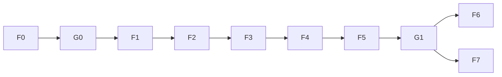

# Fases del MVP (F0–F7)

Cada fase tiene bloques fijos:

- Objetivo de negocio
- Qué vas a ver funcionando
- Cómo probarlo (checklist dueño)
- Señal de OK / Señal de seguir iterando
- Qué pedirle al agente
- Para quien construye

**Regla:** una fase a la vez. No avances sin Señal de OK.

---

## F0 — Documentación y alineación

### Objetivo de negocio
Todos entienden qué producto vamos a armar y qué queda fuera, antes de tocar pantallas nuevas.

### Qué vas a ver funcionando
Esta carpeta `docs/mvp/` completa y coherente (no es una app todavía).

### Cómo probarlo
1. Abre [README.md](./README.md) y [00-vision.md](./00-vision.md).
2. Lee [GUIA-DUENO.md](./GUIA-DUENO.md).
3. Confirma en voz alta (o en el chat): actor principal = delivery; comercios solo por link; WhatsApp = abrir chat, no envío automático.
4. Confirma anti-objetivos: sin login comercio, sin M:N, sin WhatsApp API.

### Señal de OK
- [ ] Dueño y agente usan el mismo glosario (pedido, link, confirmado, en camino).
- [ ] Queda claro el orden F1→F7.
- [ ] No hay duda sobre “el pedido se guarda aunque no manden el WhatsApp”.

### Señal de seguir iterando
- Alguien pide “login del comercio” o “mensajes automáticos sin abrir WhatsApp” como si fueran de este MVP.
- Falta un documento de la lista del README.

### Qué pedirle al agente
```text
Confirma que docs/mvp está completa según el plan dual (negocio + técnico).
Lista huecos en lenguaje simple. No implementes código.
```

### Para quien construye
- Entregable = docs únicamente.
- Referencias de dominio: [01-domain-model.md](./01-domain-model.md), flujos [02-flows.md](./02-flows.md).

---

## G0 — Graphify baseline (ahora, antes de F1)

Gate de **arquitectura / repo**, no de producto. Sirve para saber qué del árbol actual es **valioso** (pricing, geofence, maps, whatsapp) vs **ruido** (portales admin/merchant/rider legacy).

### Objetivo de negocio
Antes de construir el panel nuevo, tenemos un mapa del código viejo para no reescribir lo útil ni arrastrar basura.

### Qué vas a ver funcionando
- Herramienta `graphify` instalada (`graphifyy` vía uv).
- Salida en `graphify-out/` (`graph.json`, `GRAPH_REPORT.md`, `graph.html`).
- Lista corta: **valioso** vs **ruido** alineada con [05-migration-from-current.md](./05-migration-from-current.md).

### Cómo probarlo (dueño + agente)
1. Pregunta al agente: “¿Graphify ya corrió? Resume valor vs ruido en 5 bullets.”
2. Abre (o pide que te lean) `graphify-out/GRAPH_REPORT.md`: debe mencionar nodos como `PricingService`, `GeofenceService`, maps.
3. Confirma que los portales viejos (`/admin`, `/merchant` login, `/settlements` B2B) quedan marcados como **no priorizar**.
4. No bloquees F1 si el HTML del grafo no se abre; basta el reporte + lista valor/ruido.

### Señal de OK
- [ ] `graphify-out/graph.json` existe.
- [ ] Hay acuerdo escrito (en chat o en migration doc) de qué se reusa.
- [ ] F1 puede empezar sin “limpiar todo el repo” primero.

### Señal de seguir iterando
- El agente quiere reescribir pricing/geofence desde cero.
- No queda claro qué pantallas son legacy.

### Qué pedirle al agente
```text
Corre / actualiza graphify sobre el repo.
Con GRAPH_REPORT.md y docs/mvp/05-migration-from-current.md,
dame lista VALIOSO vs RUIDO (máx 10 ítems cada una). No borres código aún.
```

### Para quien construye
- `uv tool install graphifyy` (o upgrade).
- `graphify install --platform cursor` (regla `.cursor/rules/graphify.mdc`).
- Rebuild: AST extract → `graphify-out/graph.json` + `GRAPH_REPORT.md`.
- Tip: `GEMINI_API_KEY` opcional para semántica de docs/imágenes; el baseline de código no la necesita.
- Detalle: [06-graphify.md](./06-graphify.md).

---

## F1 — Auth del delivery + panel vacío

### Objetivo de negocio
El delivery tiene su espacio privado: entra con usuario y clave y ve “su” panel (aunque aún esté vacío).

### Qué vas a ver funcionando
- Pantalla de login.
- Tras login: panel del delivery (placeholder: “Sin pedidos” / menú básico).
- Cerrar sesión.

### Cómo probarlo
1. Abre la URL de login que te indique el agente.
2. Entra con el usuario de prueba.
3. Verifica que ves el panel (no la home vieja de roles mezclados, o al menos un área clara “Mi panel”).
4. Cierra sesión e intenta entrar de nuevo.
5. (Si aplica) Prueba una clave incorrecta: debe fallar con mensaje claro.

### Señal de OK
- [ ] Login correcto entra al panel.
- [ ] Logout funciona.
- [ ] Sin login no se puede ver el panel del delivery.

### Señal de seguir iterando
- Entras sin clave.
- Ves datos de otro usuario (si hay más de uno de prueba).
- No hay forma de salir.

### Qué pedirle al agente
```text
Implementa la Fase F1 según docs/mvp/03-phases.md.
Solo esa fase. Al terminar, dime URL y usuario de prueba para la checklist del dueño.
```

### Para quien construye
- Auth sesión (email + password hash) para rol delivery.
- Rutas protegidas del panel (ej. `/app` o `/delivery`).
- Seed de un DeliveryUser de prueba.
- Aún no: comercios, pedidos, WhatsApp.

---

## F2 — Comercios afiliados + link con token

### Objetivo de negocio
El delivery carga sus comercios y obtiene un link por cada uno para compartir.

### Qué vas a ver funcionando
- Alta / listado de comercios en el panel.
- Botón “Copiar link”.
- Abrir el link en ventana privada: pantalla del comercio (puede ser placeholder del form).

### Cómo probarlo
1. Entra como delivery.
2. Crea un comercio con nombre, teléfono, dirección en zona.
3. Copia el link.
4. Ábrelo en otro navegador o modo incógnito (sin estar logueado).
5. Debes ver algo asociado a **ese** comercio (nombre visible).
6. Crea un segundo comercio: el link debe ser distinto.

### Señal de OK
- [ ] Dos comercios → dos links distintos.
- [ ] Link abre sin login.
- [ ] Link de A no muestra datos de B.

### Señal de seguir iterando
- Link roto o pide login al comercio.
- No se puede copiar el link.
- Comercio fuera de zona se guarda igual (debe rechazarse o avisar).

### Qué pedirle al agente
```text
Implementa la Fase F2 según docs/mvp/03-phases.md.
Incluye copiar link y página pública /m/{token}. Solo F2.
```

### Para quien construye
- Modelo `Merchant` con `deliveryUserId` + `publicToken`.
- CRUD autenticado.
- Ruta pública `/m/[token]`.
- Geofence al crear comercio (reusar `GeofenceService`).
- Aún no: cotización completa ni submit de pedido (placeholder OK).

---

## F3 — Formulario de cotización (mapa + pegar ubicación)

### Objetivo de negocio
Desde el link, el comercio arma el pedido y ve una tarifa confiable antes de enviar.

### Qué vas a ver funcionando
- Form: qué es, tamaño, destinatario, teléfono, origen, destino.
- Destino por mapa/Places **y** por pegar link de ubicación.
- Cotización visible (distancia, tiempo, precio).
- Error claro si está fuera de zona.

### Cómo probarlo
1. Abre el link de un comercio.
2. Llena datos básicos del paquete y del que recibe.
3. **Prueba A — mapa:** elige destino en zona; verifica que aparece tarifa > 0.
4. **Prueba B — pegar link:** pega un link de Google Maps / ubicación de WhatsApp de un punto en zona; verifica que toma lat/lng y cotiza.
5. Prueba un destino fuera de Valencia/Naguanagua/San Diego: debe **bloquear** o mostrar error, no cotizar como válido.
6. Cambia a destino más lejos (sigue en zona): la tarifa debe subir o mantener coherencia con la distancia.

### Señal de OK
- [ ] Mapa y pegar link generan cotización.
- [ ] Fuera de zona no deja seguir como válido.
- [ ] Campos obligatorios se exigen antes de “enviar” (aunque el envío real sea F4).

### Señal de seguir iterando
- Pegar link no reconoce coordenadas.
- Tarifa en 0 o absurda.
- No hay diferencia local vs más lejos.

### Qué pedirle al agente
```text
Implementa la Fase F3 según docs/mvp/03-phases.md.
Reutiliza pricing, geofence y parse de maps. Cotización en el form público. No hace falta persistir el pedido aún si F4 lo cubre — pero si ya cotiza vía API /api/quote, mejor.
```

### Para quien construye
- UI form en `/m/[token]`.
- Integrar Places + input paste; `parseGoogleMapsInput` / API `maps/resolve`.
- `PricingService` + geofence en quote.
- Campos según [01-domain-model.md](./01-domain-model.md).
- Submit persistente → F4.

---

## F4 — Enviar solicitud: guardar + WhatsApp al delivery

### Objetivo de negocio
Al enviar, el pedido queda registrado para el delivery aunque el comercio no abra o no mande el WhatsApp; el botón prepara el chat al delivery.

### Qué vas a ver funcionando
- Botón enviar en el form.
- Pedido aparece en el panel del delivery como **Solicitado**.
- Botón/acción que abre `wa.me` al teléfono del delivery con resumen.
- Caso: cerrar WhatsApp sin enviar → pedido **sigue** en el panel.

### Cómo probarlo
1. Completa un pedido válido (F3) y envía.
2. Sin tocar WhatsApp (o cerrándolo): entra al panel del delivery.
3. Verifica que el pedido está en **Solicitado** con los datos correctos.
4. Vuelve al flujo del comercio (o usa el botón del panel si existe) y abre WhatsApp: el chat debe ir al número del delivery y el texto debe traer resumen + referencia del pedido.
5. Repite otro pedido y abre WhatsApp esta vez: igual debe verse en panel.

### Señal de OK
- [ ] Pedido persistido en `DRAFT_SUBMITTED` sin depender de WhatsApp.
- [ ] Panel lista el pedido del comercio correcto.
- [ ] `wa.me` apunta al delivery correcto con texto útil.

### Señal de seguir iterando
- Pedido solo existe si se envió el WhatsApp.
- WhatsApp abre al número equivocado.
- Panel vacío tras enviar.

### Qué pedirle al agente
```text
Implementa la Fase F4 según docs/mvp/03-phases.md y el copy de docs/mvp/04-data-whatsapp-copy.md (mensaje al delivery).
Prioridad: persistir DRAFT_SUBMITTED antes del wa.me.
```

### Para quien construye
- `POST` público autenticado por token → crea `Order` `DRAFT_SUBMITTED`.
- Generar `WhatsAppService` (o extender) mensaje “nueva solicitud”.
- Panel lista órdenes del `deliveryUserId` filtrando pendientes.
- No confirmar aún (eso es F5).

---

## F5 — Confirmar → en camino → entregar (+ WA destinatario)

### Objetivo de negocio
El delivery cierra el ciclo operativo: acepta, retira avisando al que recibe, entrega y acredita su ganancia.

### Qué vas a ver funcionando
- Botón **Confirmar** → estado “Va a buscar” (sin WA al remitente).
- Botón **En camino / Ya retiré** → abre WhatsApp al **destinatario**.
- Botón **Entregado** → estado final + monto acreditado a la carrera/mes.

### Cómo probarlo
1. Parte de un pedido **Solicitado** en el panel.
2. Confirma: estado cambia a “Va a buscar”. No debe exigir WhatsApp.
3. Marca en camino: se abre WhatsApp al teléfono del **destinatario** (no al del delivery). Lee el texto: debe sonar como el delivery (“soy {nombre}…”).
4. Marca entregado: estado Entregado; ves monto de ganancia de esa carrera.
5. Intenta “saltar” estados (si la UI lo permite): no debería ir de Solicitado a Entregado directo.

### Señal de OK
- [ ] Transiciones en orden.
- [ ] WA en camino = destinatario + copy correcto.
- [ ] Entregado acredita ganancia.
- [ ] Confirmar no dispara WA al comercio.

### Señal de seguir iterando
- WA en camino va al delivery o al comercio.
- Entregar no deja registro de dinero.
- Se puede confirmar dos veces o romper estados.

### Qué pedirle al agente
```text
Implementa la Fase F5 según docs/mvp/03-phases.md y copy destinatario en docs/mvp/04-data-whatsapp-copy.md.
Máquina de estados DRAFT_SUBMITTED → CONFIRMED_PICKUP → IN_TRANSIT → DELIVERED.
```

### Para quien construye
- PATCH status con `ALLOWED_TRANSITIONS` nuevos.
- Timestamps `confirmedAt`, `pickedUpAt`, `deliveredAt`.
- Calcular/persistir `riderEarnings` al entregar (regla 80% o la vigente).
- UI botones + abrir `wa.me` solo en transición a `IN_TRANSIT`.

---

## G1 — Segunda pasada Graphify (limpiar árbol: valor vs ruido)

Gate **después de F5** (ciclo de pedido real en código). Aquí sí se decide qué borrar, archivar o dejar de mantener del MVP viejo.

### Objetivo de negocio
El repo refleja el producto nuevo: menos pantallas muertas, menos confusión para el agente, y queda claro qué sigue siendo valioso.

### Qué vas a ver funcionando
- Graphify **rebuild** sobre el código post-F5.
- Documento corto (o sección actualizada en migration): tabla **VALIOSO / RUIDO / ARCHIVAR**.
- Acciones concretas: rutas legacy ocultas o movidas, home apunta al flujo delivery, README raíz actualizado.

### Cómo probarlo
1. Pide al agente rebuild de graphify + diff vs baseline G0.
2. Pregunta: “¿El grafo muestra el flujo delivery → merchant token → order → whatsapp, o sigue dominando admin/rider viejo?”
3. Revisa la lista valor/ruido: cada ítem de ruido tiene acción (ignorar / deprecar UI / borrar en PR aparte).
4. Dueño: abre la app — no debería caer en portales viejos como camino principal.
5. Checklist de F5 sigue pasando después de la limpieza (no romper el ciclo).

### Señal de OK
- [ ] Rebuild de `graphify-out/` hecho post-F5.
- [ ] Lista valor vs ruido acordada y aplicada (al menos: home/navegación ya no empuja legacy).
- [ ] F5 checklist sigue en verde.
- [ ] Se puede pasar a F6/F7 sin “código zombi” en el camino feliz.

### Señal de seguir iterando
- Graphify sigue mostrando hubs solo de UI legacy sin nodos del panel delivery.
- Se borró algo valioso (pricing/geofence) por error.
- F5 se rompió al limpiar.

### Qué pedirle al agente
```text
Fase G1 según docs/mvp/03-phases.md y docs/mvp/06-graphify.md.
1) Rebuild graphify.
2) Compara con baseline G0: VALIOSO vs RUIDO.
3) Propón PR de limpieza (sin romper F5). Espera OK del dueño antes de borrar en masa.
```

### Para quien construye
- `graphify update` / re-extract AST (+ semántica docs si hay `GEMINI_API_KEY`).
- Diff de god nodes / communities vs G0.
- Limpieza quirúrgica: no mezclar con F6/F7 en el mismo PR si el diff es grande.
- Actualizar [05-migration-from-current.md](./05-migration-from-current.md) con el veredicto final.

---

## F6 — Foto opcional del paquete

### Objetivo de negocio
El comercio puede adjuntar una foto para que el delivery sepa qué va a retirar.

### Qué vas a ver funcionando
- Campo opcional de foto en el form del link.
- La foto se ve en el detalle del pedido en el panel.

### Cómo probarlo
1. Crea un pedido **con** foto: aparece en el panel.
2. Crea un pedido **sin** foto: igual se puede enviar.
3. Verifica que la imagen se abre/ve bien en móvil.

### Señal de OK
- [ ] Foto opcional (no bloquea envío).
- [ ] Visible para el delivery.
- [ ] Pedido sin foto sigue OK.

### Señal de seguir iterando
- Obliga foto.
- Foto no carga o rompe el envío.
- Delivery no la ve.

### Qué pedirle al agente
```text
Implementa la Fase F6 según docs/mvp/03-phases.md.
Storage simple (local/public o equivalente MVP). Foto opcional.
```

### Para quien construye
- Upload + `packagePhotoUrl` en `Order`.
- Validar tipo/tamaño razonables.
- Mostrar en detalle panel.

---

## F7 — Métricas del mes para el delivery

### Objetivo de negocio
El delivery entiende su mes: cuánto ganó, cuánto recorrió, cuántas carreras y ritmo por día.

### Qué vas a ver funcionando
Pantalla o sección “Este mes” con al menos:
- Ganado total del mes
- Kilómetros recorridos (suma de distancias entregadas)
- Cantidad de carreras entregadas
- Carreras por día (lista o gráfico simple)

### Cómo probarlo
1. Entrega 2–3 pedidos de prueba en el mes actual (o usa datos seed).
2. Abre métricas: los números deben cuadrar a ojo (suma de ganancias, conteo).
3. Un pedido cancelado **no** debe sumar.
4. Un pedido solo “solicitado” **no** debe sumar como carrera del mes.

### Señal de OK
- [ ] Cuatro métricas visibles y coherentes con pedidos entregados.
- [ ] Cancelados / no entregados excluidos.
- [ ] Delivery solo ve **sus** números.

### Señal de seguir iterando
- Números no cuadran.
- Incluye pedidos de otro mes o no entregados.
- Pantalla vacía con datos existentes.

### Qué pedirle al agente
```text
Implementa la Fase F7 según docs/mvp/03-phases.md.
Dashboard mensual del delivery autenticado. Solo agregados de DELIVERED.
```

### Para quien construye
- Endpoint/agregaciones por `deliveryUserId` + rango de mes.
- UI simple (tabla por día + KPIs).
- Reusar ideas de `settlement.ts` si aplican; no reutilizar liquidación B2B legacy sin adaptar.

---

## Orden recomendado y dependencias



- **G0** = baseline Graphify (antes de F1). No bloquea producto si el dueño ya alineó F0; sí recomendado para el agente.
- **G1** = segunda pasada post-F5: limpiar árbol (valor vs ruido) antes de F6/F7.
- F6 y F7 en paralelo **después de G1** (o en paralelo entre sí tras G1).

---

## Índice cruzado

| Necesitas | Documento |
|-----------|-----------|
| Probar sin código | [GUIA-DUENO.md](./GUIA-DUENO.md) |
| Campos y estados | [01-domain-model.md](./01-domain-model.md) |
| Historia + WA | [02-flows.md](./02-flows.md) |
| Textos exactos | [04-data-whatsapp-copy.md](./04-data-whatsapp-copy.md) |
| Repo actual | [05-migration-from-current.md](./05-migration-from-current.md) |
| Graphify G0/G1 | [06-graphify.md](./06-graphify.md) |
